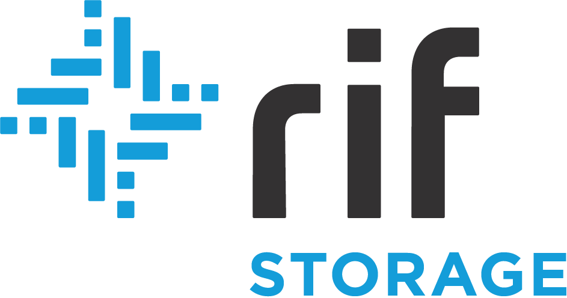

# Swarm for Node Operators - Run an incentivised Swarm node
> Playful introduction to running an incentivized Swarm node, the chequebook smart-contract and the Swarm Accounting Protocol

**important:** Bring your laptop to participate

## Facilitators
| **Rinke Hendriksen**| **Vojtech Simetka** | **Swarm Team** | **IOV-team**
| --- | --- | --- | --- 
|  |  ||  |	|
| [@eknir](https://github.com/eknir/) | [@vojtechsimetka](https://github.com/vojtechsimetka)| [@ethersphere](https://github.com/vojtechsimetka)| [@RSK Labs](https://github.com/RSKSmart)| 

## Course material
- View the handout: [handout](./WORKSHOP.md)

## About the workshop
In this workshop we will playfully introduce you to setting up up and operating an incentivised Swarm node - marking the first ever live test of an  incentivised Swarm Network. The workshop will cover installation and setup, security best practices, a UI demonstration & a walkthrough. This represents joint work of the Swarm Team and IOV Labs.

## About the facilitators

### Vojtech
Vojtech is a software developer, product owner for RIF Storage, passionate volunteer, co-founder and core contributor of Blockchain for Humanity and Giveth initiatives. He has worked at CERN, the European Organization for Nuclear Research, as a software developer leading small team to develop tool similar to google street view and as Parallel Database Configuration Manager. While at CERN he helped to organize and coach a number of humanitarian hackathons where they’ve combined creative minds from CERN and non-profit organizations in interdisciplinary teams to work on current humanitarian problems.​ In 2017, Vojtech left CERN to fully focus on Giveth and Blockchain for Humanity and is currently developing decentralised storage solution for RIF OS.

### Rinke
Rinke Hendriksen is a smart-contract developer and crypto-economist and, being part of the Swarm incentive track, he has contributed to making incentives on Swarm reality. Rinke has a background in economics and Finance, with a Bachelor of Science in Economy and all exams passed to call himself a Chartered Alternative Investment Analyst. Nevertheless, he decided not to follow the conventional path and choose to pursue a career in Blockchain instead. After following the MSc in Digital Currencies at the University of Nicosia and spending many spare hours to become up to speed with (smart-contract) development he now contributes full force to make the blockchain vision a success.

### About the Swarm team
Various members of the Swarm team will assist during the workshop.

[Swarm](https://swarm.ethereum.org/) is a distributed storage platform and content distribution service, a native base layer service of the ethereum web3 stack that aims to provide a decentralized and redundant store for dapp code, user data, blockchain and state data. Swarm sets out to provide various base layer services for web3, including node-to-node messaging, media streaming, decentralised database services and scalable state-channel infrastructure for decentralised service economies.

### About IOV Labs
Various members of the IOV team will assist during the workshop.

[IOV Labs](https://www.iovlabs.org/) is a purpose driven organization focused on developing the platforms needed for a new blockchain-based financial system that will enable worldwide financial inclusion and bridge the gap between these nascent technologies and mass adoption.

[RIF OS](rifos.org/), a project of IOV labs is a suite of open and decentralized infrastructure protocols that enable faster, easier and scalable development of distributed applications (dApps) within a unified environment to enable mass adoption of Bitcoin and RSK.

